<p align="center">
  
</p>

<h1 align="center">SpeedWatch</h1>

<p align="center">
  A self-hosted internet speed and latency monitor for people who like receipts when the network acts suspicious.
</p>

<p align="center">
  <a href="#features">Features</a> ·
  <a href="#quick-start">Quick Start</a> ·
  <a href="#docker">Docker</a> ·
  <a href="#portainer">Portainer</a>
</p>

<p align="center">
  
  
  
  
</p>

---

## Why SpeedWatch?

SpeedWatch runs scheduled speed tests, stores the results locally, and turns them into a clean dashboard with download, upload, ping, latency, provider, and history views.

Use it to answer the real questions:

- Is my ISP delivering the plan I pay for?
- Did latency spike while I was gaming, streaming, or on a call?
- Are my own websites reachable from home?
- What changed over the last 24 hours, 7 days, or 30 days?

## Features

- Scheduled internet speed tests with manual "run now" support
- Cloudflare, Google, Ookla, and configurable LibreSpeed provider support
- Download, upload, ping, jitter, ISP, client IP, and server metadata
- Latency monitoring for custom URLs
- "My Sites" checks for tracking websites you care about
- Combined dashboard timeline for speed and latency events
- Threshold alerts based on your internet plan
- SQLite persistence with configurable retention
- Responsive React dashboard with charts, tables, themes, and unit switching
- Docker and Portainer friendly deployment

## Tech Stack

| Layer | Tools |
| --- | --- |
| Frontend | React, Vite, Tailwind CSS, Recharts, TanStack Query |
| Backend | Express, TypeScript, node-cron |
| Data | SQLite via better-sqlite3 |
| Deployment | Docker, Docker Compose, Portainer |

## Quick Start

### Requirements

- Node.js 20+
- npm

### Run Locally

```bash
git clone git@github.com:noorshikalgar/local-speedtest.git
cd local-speedtest
npm run install:all
npm run dev
```

Open the app:

- Frontend: http://localhost:5173
- Backend API: http://localhost:3005

The SQLite database is created automatically at `backend/data/speedwatch.db`.

## Docker

Build and run the app as a single container:

```bash
docker build -t speedwatch .

docker run -d \
  --name speedwatch \
  -p 3001:3001 \
  -v speedwatch-data:/app/backend/data \
  --restart unless-stopped \
  speedwatch
```

Open http://localhost:3001.

The volume keeps `speedwatch.db` alive across restarts and image updates.

### Docker Compose

```bash
docker compose up -d --build
```

## Portainer

### Stack Deployment

1. Open Portainer and go to **Stacks** -> **Add stack**
2. Name the stack `speedwatch`
3. Paste the contents of `docker-compose.yml`
4. Click **Deploy the stack**

Portainer will build the image and expose the app on port `3001`.

### Git Repository Deployment

1. Open **Stacks** -> **Add stack**
2. Select **Repository**
3. Set the repository URL to `https://github.com/noorshikalgar/local-speedtest`
4. Set the compose path to `docker-compose.yml`
5. Click **Deploy the stack**

You can enable GitOps updates in Portainer to redeploy when new changes land.

## Configuration

Most app settings are managed from the dashboard.

| Setting | Default | Notes |
| --- | --- | --- |
| Download plan | `100 Mbps` | Used for speed health and alert thresholds |
| Upload plan | `50 Mbps` | Displayed alongside test history |
| Test interval | `120 minutes` | Controls the scheduled speed test cadence |
| Retention | `90 days` | Old results are pruned automatically |
| Alert threshold | `20%` | Alerts when results drop below the configured tolerance |
| Timezone | `Asia/Kolkata` | Used for dashboard display times |
| Provider | `Cloudflare` | Can use Cloudflare, Google, Ookla, LibreSpeed, or round-robin mode |
| LibreSpeed URL | empty | Required when using the LibreSpeed provider; point it at your own LibreSpeed server |

Environment variables:

| Variable | Default | Description |
| --- | --- | --- |
| `PORT` | `3001` in Docker, `3005` locally | Port the backend listens on |
| `NODE_ENV` | `production` in Docker | Runtime environment |

## Data

SpeedWatch stores data in SQLite:

- Local development: `backend/data/speedwatch.db`
- Docker container: `/app/backend/data/speedwatch.db`

Mount `/app/backend/data` as a Docker volume so your history survives restarts, rebuilds, and updates.

## Prometheus / Grafana

SpeedWatch exposes Prometheus text metrics at:

```text
GET /metrics
```

Example Prometheus scrape config:

```yaml
scrape_configs:
  - job_name: speedwatch
    metrics_path: /metrics
    static_configs:
      - targets:
          - speedwatch:3001
```

Useful metrics include:

- `speedwatch_download_mbps`
- `speedwatch_upload_mbps`
- `speedwatch_ping_ms`
- `speedwatch_site_up`
- `speedwatch_site_latency_ms`
- `speedwatch_site_uptime_percent`
- `speedwatch_site_health_score`
- `speedwatch_site_failures_total`

## Useful Scripts

```bash
npm run install:all   # install backend and frontend dependencies
npm run dev           # run backend and frontend together
npm run build         # build frontend and backend
npm run start         # start the backend server
```

## Project Structure

```text
local-speedtest/
├── assets/                 # README and brand assets
├── backend/                # Express API, scheduler, SQLite access
├── frontend/               # React dashboard
├── Dockerfile              # Production image
├── docker-compose.yml      # Compose deployment
└── README.md
```

## Share It

SpeedWatch is built for homelabs, small offices, creators, and anyone who wants a private dashboard for network performance. Run it on a mini PC, NAS, VPS, or Raspberry Pi-class box and keep your internet history under your own roof.

---

<p align="center">
  Built with TypeScript, SQLite, and a healthy suspicion of "it works on my machine".
</p>
